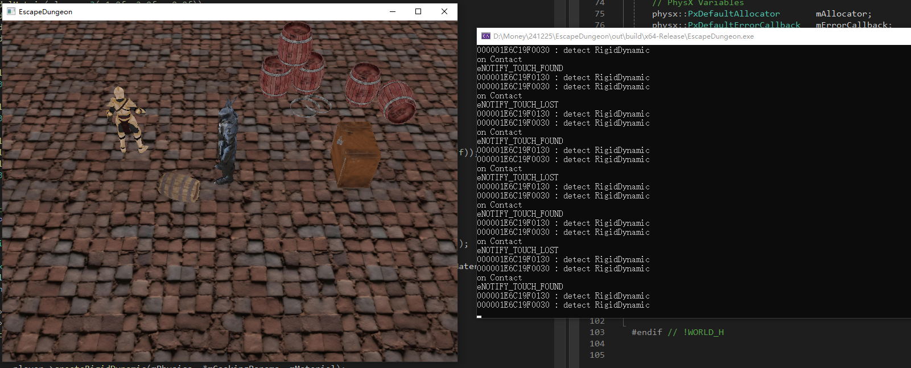
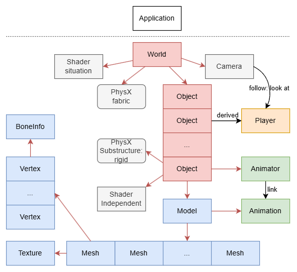
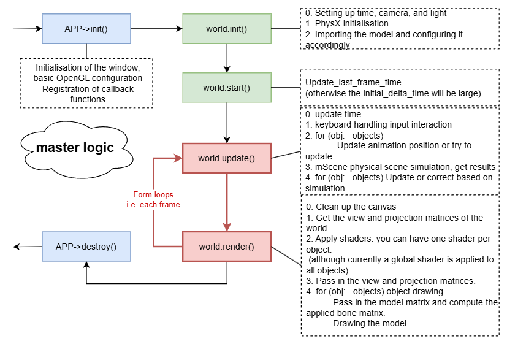

# Escape Dungeon

A simple game interaction interface implemented using the OpenGL programmable pipeline API, with the following features:

- **Window Display and Interaction Callback Setup (e.g., window resizing)**: Achieved with the GLFW library.

- **Camera Configuration and Movement**: Currently set to FOLLOW mode, with the ability to toggle modes via key presses.

- Model Import and Display: Includes support for skeletal models and animations, using the ASSIMP library.

  - Static models can be imported in formats like `.obj`, while dynamic models can use formats such as `.dae` and `.fbx`.
  - Vertex shaders support animation playback.
  - Fragment shaders support standard or Blinn-Phong lighting models (depending on the imported model, though lighting is currently not in use).

- **Background Music and Sound Effects**: Managed via the IrrKlang library.

- Physics Simulation and Collision Detection: Utilized through the PhysX library.

  - Includes static and dynamic rigid bodies, with the player defined as a kinematic rigid body.
  - 

### How to Use

Method 1: Using Visual Studio CMake (Recommend)

- Open Visual Studio with no code, Select "Open" → "CMake" on the menu, letting VS browsing through the project through CMake

- Switch to Release Mode in CMakeSettings.json generated by VS, changing the following key to value

  ```
  "configurationType": "Release"
  ```

- Save CMakeLists.txt to update CMakeCache, which would copy *.dll and assets in the the exe directory, every time before you build & run the exe

Method 2: Using Visual Studio SLN

- The project has prepared a pre-set .sln file in sln/ file to be used：After Open the sln，**REMEMBER TO switch to EscapeDungeon Project after buid and run** 

- If the current .sln in sln/ do not work, you could create your own sln one with the following command

  ```cmd
  # at the root dir of the project
  mkdir build
  cd build
  cmake -A "x64" -G "Visual Studio 17 2022" -DCMAKE_BUILD_TYPE=Release .. # which means 'Version 17, Visual Studio 2022'
  ```

- Then the .sln would be generated in the build/ directory, cd build and open the .sln，remember to run the project under"Release" version


### Dependencies

Third-party Libraries

- OpenGL 4.6
- GLFW 3.4: /MT build
- Glad
- GLM
- Assimp 3.3.1
- PhysX 5.5: /MT build
- IrrKlang 1.5

### Programming Patterns

#### Project Architecture

The foundational design is based on **LearnOpenGL** and further structured to facilitate custom model imports and placements. It also adheres to OOP programming principles. The primary class structure and relationships of the project are illustrated in the diagram below.


The main program logic is implemented in `main.cpp`.

The basic workflow during the project's runtime is illustrated in the diagram below.



**Double Buffer Pattern**

- Utilizes GLFW’s `glfwSwapBuffer()` for frame buffer double-buffered output.

- **Game Loop Pattern**

  - The main game loop in `main.cpp` is implemented as follows:
```cpp
    APP->init();
    world.init();
    world.start();
    while (APP->update()) {
        world.update();
        world.render();
    }
    APP->destroy();
```

  - Each iteration of the loop processes:

    - User input: keyboard, mouse movement, and scrolling.
    - Object updates: Player position updates, animations via `Animator` (updates bone matrices).
    - Physics simulation and results retrieval.
    - Object updates & adjustments: Updates positions based on physics simulation results, resolves collisions, and checks kinematic constraints for the Player.
    - Rendering: Applies shaders to each object, sends MVP matrices, and draws using OpenGL.

  **Update Method Pattern**

  - The `World` contains all the created `Objects`. Each frame calls `world.update()`, which in turn invokes an update method for each object to handle its frame-specific behavior.

  **Singleton Pattern**

  - The `Application` class is implemented as a singleton with a single global instance `Application::mInstance`. It integrates GLFW window configuration and callback registration, ensuring there is only one window.

  **Command Pattern**

  - Implemented in `MyCollisionCallback`, a class inheriting from `physx::PxSimulationEventCallback`. Registered in the global `mScene`, it overrides `onContact` to handle collision events.
  - Potential future implementation: User interactions (mouse, keyboard) could be abstracted as an `Interactable` interface.

**Flyweight Pattern**

- Abstracts the `Object` class using **shared pointers** to reference `Model` and `Shader`. This allows efficient use of memory to support a large number of fine-grained objects. A single `Model` can generate multiple `Objects`, reducing model load time and storage requirements while enabling flexibility in `Object` generation.

**Prototype Pattern**

- The `Object` class serves as a prototype for the `Player` class, with the `Player` inheriting and overriding specific methods unique to the player character.

### Game Mechanics

**Interaction Methods**

- **Overview**: Controls include WASD for character or camera movement, SPACE to print the character’s position, and C to toggle camera modes. Mouse movement adjusts the camera view, and mouse scrolling controls zoom.
- **Implementation**: GLFW callback functions are registered through the `Application` class, which provides pre-implemented methods to be registered as GLFW callbacks. Custom callbacks are set using a provided setter method. These functions delegate interaction handling to `World::processXXX`, which calls `Player` and `Camera` methods as needed.

**Camera Modes**

- **Overview**: Starts in FOLLOW mode where the camera locks onto the player, maintaining a relative position while following movement. Pressing C switches to FREE mode, unlocking the camera for free movement, while the player remains stationary.
- **Implementation**: The `Camera` class defines states and corresponding functions (`follow`, `free`). The `switchMode` function handles transitions, controlled via `World::processXXX`. FOLLOW mode locks onto a shared pointer to the `Player`, while FREE mode clears the pointer and unlocks the camera.

**Random Object Distribution**

- **Overview**: At world initialization, random positions are generated within specified bounds (rectangular or circular) and minimum spacing to avoid conflicts.
- **Implementation**: Overloaded `generateRandomPoints` functions provide Cartesian and polar coordinate-based generation. Positions are checked for spacing compliance, added if valid. Excessive counts may cause a deadlock.

**Model Loading and Animation Playback**

- **Overview**: Supports loading of popular model formats and animations.
- **Implementation**: Uses the ASSIMP library to import data and convert it to custom `Model`, `Mesh`, and `Vertices` structures. Animation data is interpolated to generate skeletal matrices at different timestamps. These matrices, along with MVP matrices, are passed to the vertex shader.

**Player Walking Animation, Sound Control, and Movement Constraints**

- **Overview**: The player character plays a walking animation and sound while moving. Movement is constrained within a border range (air walls ±20.0f).
- **Implementation**: The `Player` class maintains a state machine. The `update` method plays animations and sounds in the WALKING state and resets them in the IDLE state. Post-movement, position constraints are enforced by clamping the player’s position to the boundary.

**Physics-based Collision Simulation**

- **Overview**: Physical interactions include collisions between barrels and the ground, barrels and boxes, and the player and barrels.
- **Implementation**: Uses the PhysX library to define `RigidDynamic` and `RigidStatics`. The player is assigned a kinematic rigid body attribute. During `mScene->simulate(delta_time)`, physics results are computed and applied to update object positions, followed by rendering.

**Random Flying Birds**

- **Overview**: Randomly flying birds appear in the scene.
- **Implementation**: Adds a `random_move` option to the `Object` class. When active, a random starting point outside the world boundary is generated, paired with a symmetric endpoint at `(0.0f, 0.0f)`. The object moves each frame toward the target at a defined height and speed. Once the endpoint is reached, new points are generated for the next cycle.

### Software Engineering Issues

**Model and Shader Reuse**

- See the Flyweight Pattern for details.

**Model Modifications and Texture Compression**

- Large textures, such as diffuse and normal maps, are compressed to limit asset size without compromising quality.
- The ground model uses a simple rectangular plane with repeated textures. To avoid excessive scaling artifacts, a single ground model is repeated as a 3x3 grid, optimizing model size while maintaining reasonable load times.

**Bone Dependency per Vertex**

- Each vertex is assigned up to 4 influencing bone IDs and weights. Analysis of vertex data shows that for smaller models, bone dependencies rarely exceed one or two, leaving most of the 4 slots unused.

### References

- **LearnOpenGL**
  - Website: [Learn OpenGL, extensive tutorial resource for learning Modern OpenGL](https://learnopengl.com/)
  - Project Repository: https://github.com/JoeyDeVries/LearnOpenGL
- **PhysX Usage**
  - Official documentation: https://nvidia-omniverse.github.io/PhysX/physx/5.5.0/index.html
  - Initialization example: https://www.youtube.com/watch?v=zOYpVAoQFyU
  - Reference project: https://github.com/kmiloarguello/openGL-physX
    (This project can be compiled and run locally but uses PhysX 4.1, which differs from 5.5 in implementation.)

### Tools

- **Blender**: Version 4.3.2 
- **Visual Studio 2022**：Version 17

### Resources

- Models: Sketchfab, CGTrader, Free3D 
- **Background Music (BGM)**: Taken from Magic Tower Zone 1 BGM
- **Walking sound effect**: https://sc.chinaz.com/yinxiao/201201513682.htm
